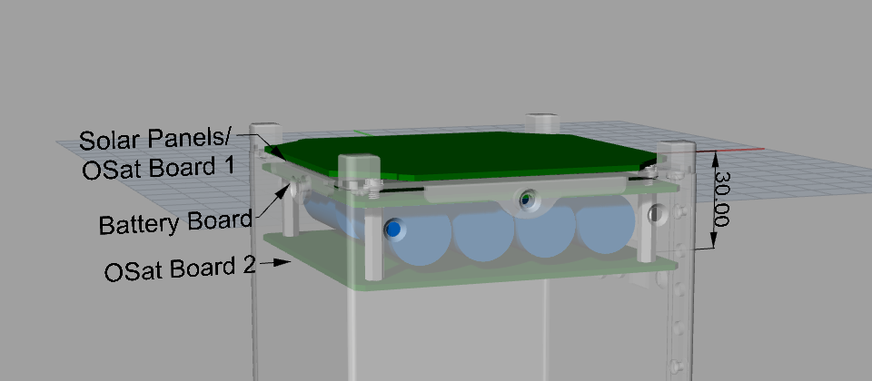
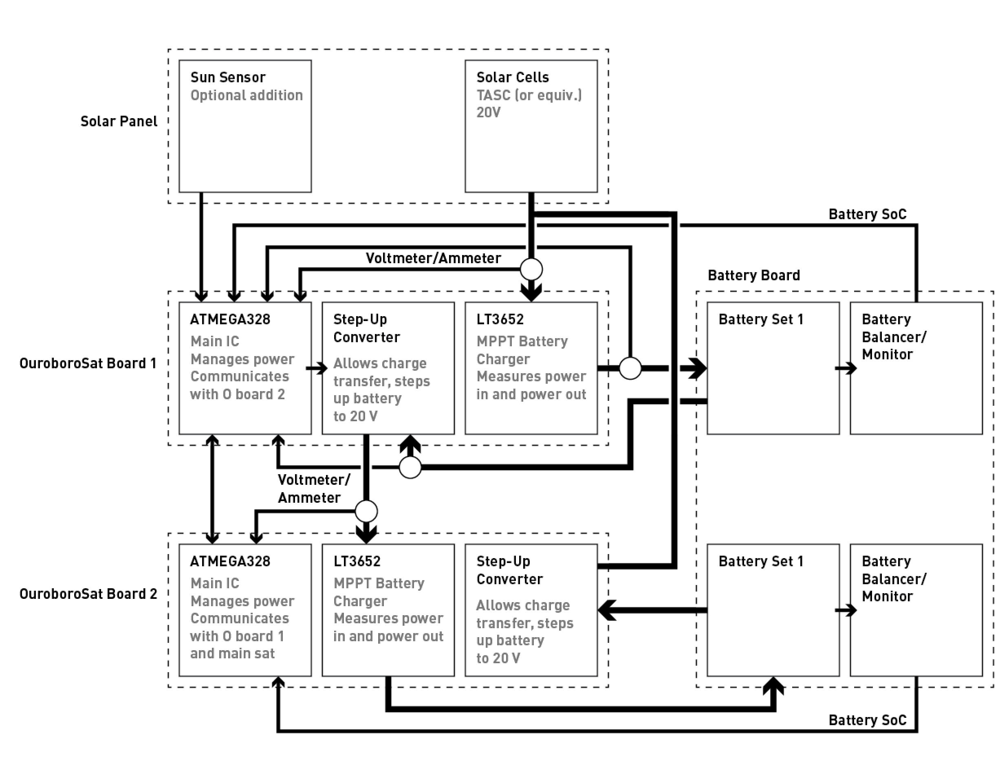

# USNA Payload

Testing high-efficiency power transfer on a cubesat.

## Description

The OuroboroSat-USNA project is a collaboration between the NASA Ames Research Center Coded Structures Lab and The U.S. Naval Academy to produce an orbital experiment that tests a modular power system. 

 

The system consists of two OuroboroSat boards. Board 1 is connected to only solar panels, and board 2 is only connected to the spacecraft bus. The block diagram is as follows:

### Objectives

The objectives are this work are as follows

1. Test power transfer between two modules
   1. quantify transfer efficiency in the vacuum environment
   2. identify potential inefficiencies due to high temperature
2. Test indirect communications between two ouroboroSat boards
   1. quantify data and error rate for communication due to radiation
3. Quantify fatigue of power storage systems in the space environment
   1. degradation of overall capacity over many charge/discharge cycles

These objectives will establish critical parameters in the design of modular spacecraft busses, and will identify failure modes in the system due to operation in the space environment. The expected TRL of this system after the test will be 7, from TRL 6 shown in the sounding rocket test.